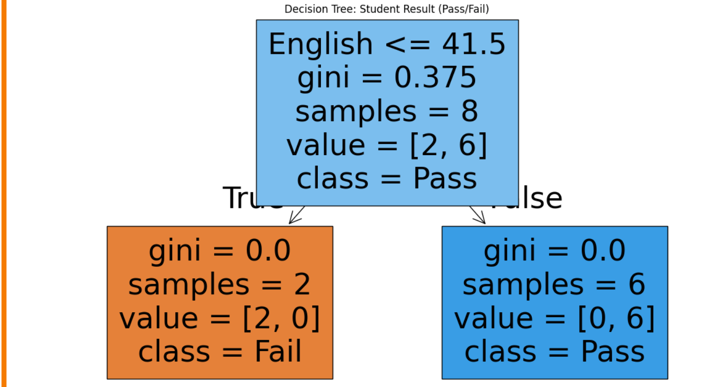

# Implementation-of-Decision-Tree-Classifier-Model-for-Predicting-Employee-Churn

## AIM:
To write a program to implement the Decision Tree Classifier Model for Predicting Employee Churn.

## Equipments Required:
1. Hardware – PCs
2. Anaconda – Python 3.7 Installation / Jupyter notebook

## Algorithm
1. 
2. 
3. 
4. 

## Program:
```
/*
Program to implement the Decision Tree Classifier Model for Predicting Employee Churn.
Developed by: kamalesh E
RegisterNumber: 25018183 
*/

import pandas as pd
from sklearn.tree import DecisionTreeClassifier, plot_tree
import matplotlib.pyplot as plt
data = {
    "Maths": [35, 78, 90, 45, 20, 60, 55, 30],
    "Science": [40, 85, 88, 50, 25, 65, 58, 35],
    "English": [45, 80, 92, 48, 30, 70, 60, 38],
    "Result": ["Pass", "Pass", "Pass", "Pass", "Fail", "Pass", "Pass", "Fail"]
}
df = pd.DataFrame(data)
X = df[["Maths", "Science", "English"]]
y = df["Result"]
model = DecisionTreeClassifier(criterion="gini", max_depth=3)
model.fit(X, y)
plt.figure(figsize=(14, 8))
plot_tree(
    model,
    feature_names=["Maths", "Science", "English"],
    class_names=["Fail", "Pass"],
    
    filled=True
)
plt.title("Decision Tree: Student Result (Pass/Fail)")
plt.show()
```

## Output:



## Result:
Thus the program to implement the  Decision Tree Classifier Model for Predicting Employee Churn is written and verified using python programming.
